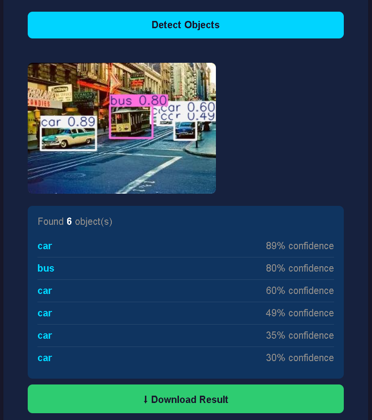
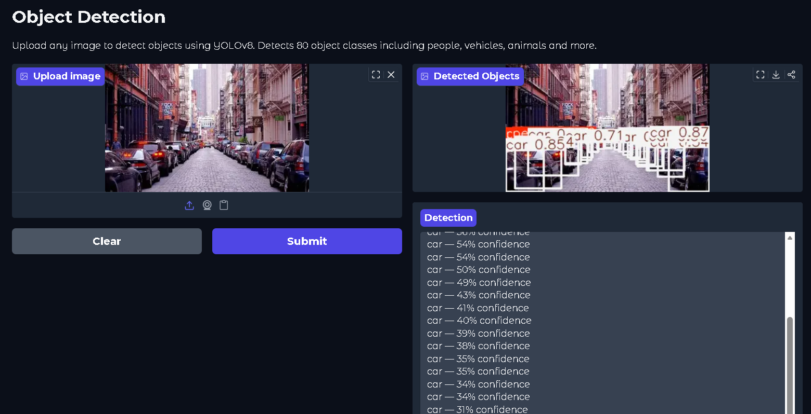

# Object Detection API

Upload any image to detect objects using YOLOv8. Built with FastAPI, deployed on Hugging Face Spaces.

[](https://huggingface.co/spaces/roy2526/object-detection)

---

## Live Demo

🚀 **[Try it here → roy2526/object-detection](https://huggingface.co/spaces/roy2526/object-detection)**

---

## What it does

Upload any image and the API will:
- Detect all objects in the image using YOLOv8
- Draw bounding boxes around each detected object
- Return confidence scores for each detection
- Allow downloading the annotated image

Detects **80 object classes** from the COCO dataset including people, vehicles, animals, furniture and more.

---

## Results

### Render deployment


### Hugging Face deployment


---

## Tech stack

YOLOv8 (ultralytics)  →  object detection model

FastAPI               →  REST API framework

Gradio                →  web interface on Hugging Face

Hugging Face Spaces   →  deployment (16GB RAM, free)

---

## API Endpoints

| Method | Endpoint | Description |
|--------|----------|-------------|
| GET | `/` | Health check + web interface |
| POST | `/detect/json` | Returns JSON list of detected objects |
| POST | `/detect/image` | Returns annotated image with bounding boxes |
| POST | `/detect` | Returns JSON + message to get annotated image |

### Sample JSON response
```json
{
  "filename": "street.jpg",
  "total_objects": 6,
  "detections": [
    {"label": "car",  "confidence": 0.89, "bbox": {"x1": 80,  "y1": 210, "x2": 200, "y2": 310}},
    {"label": "bus",  "confidence": 0.80, "bbox": {"x1": 215, "y1": 195, "x2": 320, "y2": 310}},
    {"label": "car",  "confidence": 0.60, "bbox": {"x1": 310, "y1": 210, "x2": 445, "y2": 285}}
  ]
}
```

---

## How to run locally

```bash
git clone https://github.com/Ragul2526/object-detection-api
cd object-detection-api
pip install -r requirements.txt
uvicorn main:app --reload
```

Then open `http://localhost:8000` .

---

## Deployment journey

Initially deployed on **Render** (free tier) but hit 512MB RAM limitations with YOLOv8 — the model alone needs ~300MB leaving no room for FastAPI and OpenCV.

Switched to **Hugging Face Spaces** which provides 16GB RAM for ML workloads — no memory issues, faster inference, stays awake.

Render deployment:       https://object-detection-api-yetm.onrender.com

Hugging Face deployment: https://huggingface.co/spaces/roy2526/object-detection
---

## YOLOv8 model variants

| Model | Size | Speed | Accuracy |
|-------|------|-------|----------|
| YOLOv8n (used) | 6MB | fastest | good |
| YOLOv8s | 22MB | fast | better |
| YOLOv8m | 52MB | medium | very good |
| YOLOv8l | 87MB | slow | excellent |
| YOLOv8x | 136MB | slowest | best |

Using **nano** for free tier compatibility. Swap to a larger model for better accuracy.

---

## Limitations
- YOLOv8 detects 80 COCO classes — objects outside these classes may be misclassified as the closest known class
- Free tier Hugging Face Spaces may have cold start delays
- Very small or heavily overlapping objects may be missed

---

## Requirements

fastapi

uvicorn

ultralytics

python-multipart

pillow

opencv-python-headless

gradio

numpy

---

## Tech stack
